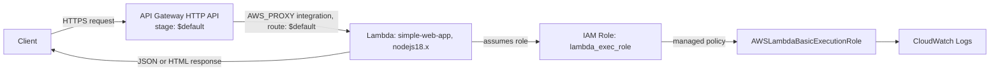

# Serverless Lambda Web App (Terraform)

A single Lambda function behind an API Gateway HTTP API, provisioned entirely with Terraform. The Lambda is a small Node.js router that handles a handful of routes itself (`/`, `/api/hello`, `/api/health`, `/api/example/{id}`) and returns either JSON or a hand-rolled HTML page. There's no framework, no database, and no build step — the whole app is the one `index.js` file, zipped up by Terraform's `archive_file` data source and shipped straight to Lambda.

I built it this way to have a minimal, fast-to-deploy example of a Lambda-backed HTTP API that doesn't drag in API Gateway REST resources, Express, or a bundler. Everything that would normally be API Gateway routing configuration lives in the Lambda's own `routes` object instead.

## Architecture



The API Gateway resource is an HTTP API (`aws_apigatewayv2_api`), not a REST API. For a single Lambda handling all its own routing, HTTP APIs are cheaper and have a smaller Terraform footprint — there's no need for REST API resources, methods, or method responses. The `$default` route with `AWS_PROXY` integration means literally any path and method reaches the same Lambda; the routing logic (matching `GET /api/hello`, extracting `{id}` from `/api/example/{id}`, etc.) is done in plain JavaScript in `index.js` rather than in Terraform or API Gateway configuration. That trades some API Gateway features (per-route throttling, request validation, API keys) for a much simpler infra definition.

The Lambda's IAM role only has `AWSLambdaBasicExecutionRole` attached, which grants CloudWatch Logs write access and nothing else. That's deliberate, not an oversight: the function doesn't touch DynamoDB, S3, or any other AWS service, so there's no reason to grant it more than logging permissions. Packaging is equally minimal — `package.json` has no dependencies, so `archive_file` just zips the single `index.js` file rather than running `npm install` or a bundler.

## Project structure

```
.
├── .gitignore
├── README.md
├── index.js         # Lambda handler and route logic
├── main.tf          # Provider, IAM role, Lambda, API Gateway
├── variables.tf      # aws_region / aws_profile inputs
└── package.json      # No runtime dependencies; packaging script only
```

## How to run this

```bash
git clone https://github.com/soodrajesh/Serverless-Lambda-WebApp-Terraform.git
cd Serverless-Lambda-WebApp-Terraform

terraform init
terraform plan -var="aws_region=eu-west-1" -var="aws_profile=your-cli-profile"
terraform apply -var="aws_region=eu-west-1" -var="aws_profile=your-cli-profile"
```

Both variables default to `eu-west-1` and `default`, so `terraform apply` works as-is if you already have a `default` AWS CLI profile with permissions to create IAM roles, Lambda functions, and API Gateway resources. On apply, Terraform prints the invoke URL as the `api_endpoint` output:

```bash
curl "$(terraform output -raw api_endpoint)/api/hello"
curl "$(terraform output -raw api_endpoint)/api/health"
```

To update the function after changing `index.js`, just run `terraform apply` again — the `archive_file` data source recomputes the zip's hash and Terraform redeploys the new code.

When done, tear it down:

```bash
terraform destroy -var="aws_region=eu-west-1" -var="aws_profile=your-cli-profile"
```

## Known gaps

There's no persistent storage. Every response is either a static string or computed at request time (timestamps, uptime, memory usage) — there's no DynamoDB table or S3 bucket backing it, so this is really a routing/API-Gateway-integration demo, not a data-driven app.

No authentication. The API Gateway route is wide open; anyone with the invoke URL can hit every endpoint.

No custom domain or TLS setup. The app is only reachable at the default `execute-api.amazonaws.com` URL that API Gateway generates — no ACM certificate, no Route 53 record, no `aws_apigatewayv2_domain_name`.

No CI/CD. Deploying a code change means running `terraform apply` from your own machine. There's no GitHub Actions workflow to run `terraform plan`/`apply` or to lint the Lambda code.

No automated tests. Nothing exercises the route matching in `index.js` or validates the Terraform plan beyond `terraform validate`.

No monitoring or alarms. CloudWatch Logs are captured (via the basic execution role), but there are no CloudWatch alarms, dashboards, or X-Ray tracing configured — if the Lambda starts erroring, you'd only find out by looking.

CORS is wide open (`Access-Control-Allow-Origin: *`), which is fine for a demo but not something to carry into anything handling real user data.

Terraform state is local. There's no S3 backend or DynamoDB lock table configured, so this isn't set up for multiple people (or a CI pipeline) applying changes safely.
